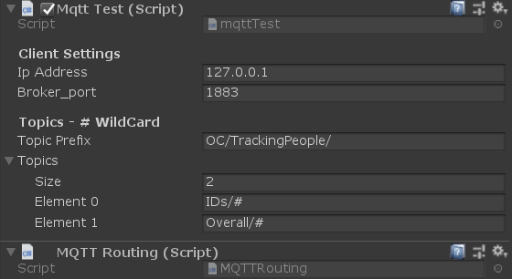
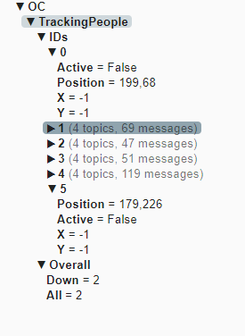

# MichaelDot forked this to do this stuff....
I have forked the original repository with the changes outlined below. They forked it from the mentioned below as well. Unity no longer allows you to generate the object with "new". I instead created a public gameobject that would have the script on it. Then you would drag the gameobject into the editor spot so that the script can access the scritps on the gameobject. All scripts are on the same object so far but, this would allow you to also add the scripts to different objects and then reference them on an object that never disables and allows you to have all of your scritps in one location referencing objects as needed.

# Plans for this in the near future
I am working to add several capabilties to access quickly in unity.

multiple subscriptions with booleans or variables to pass strings
actions based off of received messages 2A) Allowing a phone or tablet to be an interface for the game. Currently working on projection mapping with multiple scenes. If I can pass a string along to a variable then, I could enter a new location on the network to look for videos to play in the virtual projection screen scene. Send a string that switches to the scene mentioned Booleans to trigger actions Buttons in an html page on a remote device could switch scenes, restart scenes or perform other tasks.
send updates for clients to read and print out 3A) Once a string is sent, then the game could acknowledge the receipt by sending back the string to hold in a seperate variable on the html page for displaying the updated information sent to the server. Button pushes could be verified server side and updated information sent back to show this visually
I will add scenes and examples as I improve on this library. So far I can receive info and do whatever with whtat comes in. Need to create editor scripts that are mor einformative and not require any coding on the original scripts after the fact. All from within the editor.

# How to use this in a project
2 visible scripts are needed:
Mqtttest
MQTTRouting

I used an empty game object to house these scripts. I have a commented area within the routing script that would allow updating a text mesh objects text with the received string.
The test script has exposed variables for:
IP address
Broker port
username
password
I have not had to use the exposed fiekds for topics since it seems the routing script takes care of all of that. Maybe it works in another way that is beneficial. I would like to adapt this to make it much more portable. Expanding the amount of listeners and booleans to match the listeners, on the fly. I do not have enough experience to build that out yet. It is a matter of time really though. I can add as many strings to "listen" for under the topic subscribed to in Topic1 from the inspector.

The array in the test script expands but, not sure how to utilize it. I did not fully remove it because it may be the answer to the above, not sure.

I have a scene management script within unity that is on the same mqtt object that the booleans from the routing script are read from. Then somethign happens when triggered and the function ends with the boolean being reset to false. This way, i can remotely control the scenes from a phone without having to touch the pc. this is all for controlling a projection mapping system and I needed a method that would be easy enough to hand to someone without them messing the actual system up. Simply, restarts the scene or changes to others.Sometimes the videos that are on the network location freeze and the scene must be reset.Besides adding a timing feature that automatically restarts the scene at a known amount of time, a user can manually intervene. You could do anything with it though.

I have not yet tried sending data from the game. I am sure it is easy to do but, I had no need as of yet. I would like to add some scripts for this so that the client side mqtt interface could output the current scene name and other data if needed.
At some point this unity setup will be able to stream NDI for live streams projected. Our system has two overlapping porjectors that are natively 1920x1200 and the combined resolution is 3180x12. Most people wanted to display whatever video on this not understanding it cannot happen that way. 
I created several scenes with different virtual projection screen resolutions to play videos to. The end user could switch the scene to the one with the correct resolution for output, then the video plays on the plane at the correct resolution. Eventually I will add the ability to enter a string for a location to play from. Network, youtube, NDI, OBS. If I can figure it out, I would like to have an explorer like window appear listing directories locally or on a network location to select a file from instead of with a string.

i have not added all of the assets to this that are in my game because there are proprietery things within it. I need to clean and update after I get ahead.

# Unity_MQTT
This is an edited version of [Unity3d_MQTT](https://github.com/vovacooper/Unity3d_MQTT) by vovacooper.  
  
I have made the variables more accessable to the user along with adding a routing script to keep the routing seperate from the main MQTT scripts.

## Usage

To use this script, first set the Client Settings 'Ip Address' to the address of your MQTT broker. The brokers port should be put in Broker_port feild. Ensure that a MQTT broker such as Mosquitto is running otherwise you'll get errors upon runtime. Ensure that you ensure the correct topics that you wish to subscribe too. 
All messages are routed throught the MQTT Routing script. Use this to cleanly breakdown the MQTT Topics and then prase the topic messages into usable data which you can then pass on to other functions or classes.

E.g.   

     if (MqttMessage.Topic.Contains("Global/Temperature")){     
     
          TemperatureControl TempCtrl = new TemperatureControl ();     
     
          int value = int.Parse(System.Text.Encoding.UTF8.GetString(MqttMessage.Message));   
     
          TempCtrl .setTemp(value );    
     
     }     

## Detail
  

#### IP Address
IP of the broker.

#### Broker_Port
Port of the broker

#### Topic Prefix
Prefix that is added to all topics. E.g. in the example above, the topics subscriped to are: OC/TrackingPeople/IDs/#

#### Topics
This is a list of all the topics you wish to subscribe too. Use # as a wildcard

